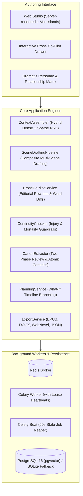

# TaleTomo — AI Web-Novel Maker

**Grow a premise into an epic world.** TaleTomo is a server-rendered Django application for planning, drafting, and continuity governance across long-form serialized fiction.

> **Status (October 1, 2026, WIB):** Full architecture prototype with 10 core expansion engines, interactive Prose Co-Pilot, Character Design & Tracking subsystem, and clean single-responsibility refactoring. The comprehensive test suite passes **174 tests (1 skipped)**. See [System Architecture & Conformance Reference](docs/ARCHITECTURE.md).

---

## Architecture Overview



---

## Core Capabilities

- **Interactive Worldbuilding Wizard:** Multi-step guided interview that scaffolds the complete story architecture: Genre/Premise ➔ World Setting & Magic System ➔ Factions & Power Dynamics ➔ AI Cast Proposal ➔ Spine & Volumes.
- **Character Design, Voice Profiling & Relationship Matrix:**
  - Rich profiles with visual `appearance`, distinctive `dialogue_style` (voice profile), active `wounds_status`, vitality (`is_alive`), `goals`, `internal_need`, `traits`, and subjective `beliefs`.
  - Pairwise `CharacterRelationship` model tracking social tension (`friendly`, `hostile`, `tense`, `neutral`, `complex`).
  - Real-time Scene & POV Presence Tracker analyzing character appearances across all chapters and scene breakdowns.
- **Hybrid Dense + Sparse Vector Retrieval (RRF):**
  - Combines sparse keyword scoring with vector cosine embeddings via Reciprocal Rank Fusion (RRF).
  - Chronological recency tiebreaking and strict deterministic anti-leakage invariants (preventing future knowledge from leaking into early scenes).
- **Composite Multi-Scene Drafting Pipeline:**
  - Slices chapter contracts into granular scene prompts with per-scene token allocations.
  - Carries rolling narrative context across scenes and executes unified continuity audits on the composite text.
- **Interactive Prose Co-Pilot & Editorial Engine:**
  - In-editor editorial directives (`show_not_tell`, `sensory_immersion`, `punch_up_dialogue`, `intensify_tension`, `expand`, `fix_continuity`).
  - Word-level HTML diff calculation (`<ins>` and `<del>`).
  - Injects character voice guidelines into rewrite prompts to preserve spoken voice consistency.
- **Story Timeline Branching ("What-If" Timelines):**
  - Diverge stories into parallel realities starting from any chapter.
  - Fully isolates branched projects while cloning bibles, spines, volumes, arcs, canon entities, relationships, items, and historical drafts.
- **Dynamic Rolling Horizon Replanning:**
  - Automatically adapts future uncommitted chapter contracts to reflect active character injuries, open plot threads, and newly confirmed canon facts.
- **Item & Inventory Continuity:**
  - Tracks unique artifacts, weapons, and relics (`Item`) with temporal destruction chapters, current holders, and locations.
- **Multi-Format Publishing Suite:**
  - Single-click export to **EPUB** (validated eBook package with styled CSS), **DOCX** (Word manuscript), **Web Novel HTML** (interactive reader with theme toggles), **Markdown**, and cryptographically verified **JSON Backup/Restore** with zero secret leakage.
- **Multi-Model Task Routing & Security:**
  - Custom task routing profiles (drafting, planning, extraction, copilot, continuity) across providers.
  - SSRF protection rejecting loopback, cloud metadata, private subnets, CGNAT, and unsafe URI schemes.
  - Fernet encryption for API keys at rest.

---

## Quickstart (Local Development)

Requirements: Python 3.12+ and dependencies in `pyproject.toml`.

```bash
# Set up virtual environment
uv venv .venv --python 3.12
uv pip install --python .venv/Scripts/python.exe -e ".[dev]"  # Windows
# On macOS/Linux, use .venv/bin/python instead.

# Run migrations and setup admin
.venv/Scripts/python.exe manage.py migrate
.venv/Scripts/python.exe manage.py createsuperuser

# Start development server
.venv/Scripts/python.exe manage.py runserver
```

For background asynchronous drafting, start Redis and a Celery worker:
```bash
# In separate terminal:
.venv/Scripts/python.exe -m celery -A config worker -l INFO --pool=solo
```

---

## Verification & Checks

```bash
# Run complete test suite (174 passed, 1 skipped)
.venv/Scripts/python.exe -m pytest -q

# System integrity and migration check
.venv/Scripts/python.exe manage.py check
.venv/Scripts/python.exe manage.py makemigrations --check --dry-run
```

- **`pytest`:** **174 passed, 1 skipped** in ~49 s.
- **`manage.py check`:** **0 issues identified**.
- **`makemigrations --check --dry-run`:** **No pending changes**.

---

## Documentation Links

- [System Architecture, Subsystems & Diagrams](docs/ARCHITECTURE.md)
- [Product Requirements Document (PRD)](docs/PRD.md)
