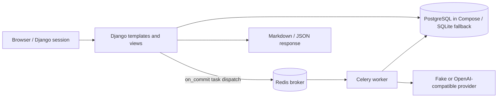

# TaleTomo — current architecture and PRD conformance

> **Scope:** `D:\projects\novel-maker`, branch `master`, commit `06eeb11` **plus uncommitted working-tree changes**, reviewed September 23, 2026 (WIB). This is a source/test/configuration review, **not** a deployed-system certification. The [PRD](PRD.md) remains the target design. The [README](../README.md) is the setup guide. Code and observed checks outrank older documents.

## 1. What is actually built

TaleTomo is a Django 5.1 modular monolith with server-rendered templates and two small Vue islands for job polling and the editor drawer (`taletomo/templates/`, `taletomo/static/js/app.js`). It uses Django sessions and login views (`config/urls.py`), PostgreSQL via `DATABASE_URL` or SQLite for local development (`config/settings.py:69-89`), Celery tasks with Redis broker (`config/celery.py`, `taletomo/generation/tasks.py`), and a per-user provider gateway. The development Compose stack has **db, redis, web, worker** services. The pgvector-enabled PostgreSQL **image** is selected, but no vector schema, index, or retrieval query is implemented.

This diagram represents configured code paths, not proof of a running or resilient deployment. No separate object store is configured. The `storage/exports` directory is created in settings but current export views return HTTP responses directly (`taletomo/web/views.py:598-643`).

## 2. Runtime topology and configuration

| Component | Current working-tree configuration | Qualification |
|---|---|---|
| Web | Compose `web`: `migrate && runserver 0.0.0.0:8088`, host port **8088** (`docker-compose.yml:32-50`) | Development server, `DEBUG=True`, bind-mounted source; **not production-ready**. |
| Worker | Compose `worker`: `celery -A config worker -l INFO` (`docker-compose.yml:52-68`) | Task dispatch via `transaction.on_commit`; no tested crash-recovery guarantee. |
| Database | PostgreSQL 16 pgvector image, host port **5433**, named volume; SQLite without `DATABASE_URL` | Vector search not implemented. Migration command is run at web startup, not by a separate migration service. |
| Redis | Redis 7, host port **6380**, named volume | Broker and result backend; application job rows live in DB. |
| API providers | Fake adapter and OpenAI-compatible chat-completions adapter (`taletomo/providers/adapters.py`) | `NATIVE` enum routes to the compatible adapter; there is **no distinct native implementation**. |
| Encryption | Fernet-based API key storage (`taletomo/core/crypto.py`) | Development fallback key exists in settings; provide your own secret outside disposable local testing. |

`CELERY_ALWAYS_EAGER` defaults to **False** (`config/settings.py:134`). When explicitly true, `.delay()` runs synchronously; that mode is for local/tests, not proof of async behavior. Docker configuration parsing succeeds; a fresh full-stack startup and provider-backed novel generation were **not** verified in this review. Local `.env` loading is not implemented by this repository.

## 3. Request and data boundaries

- Django's `@login_required` protects the application views. Project lookups check `owner=request.user`; chapter lookups also check the project; job, finding, draft comparison and provider-test lookups are user/project scoped (`taletomo/web/views.py`). The new negative tests cover representative IDOR paths (`tests/test_implementation_review_fixes.py`). No self-service signup exists.
- Project creation is **one form**, not the PRD's resumable multi-step wizard. `PlanningService.create_project_with_scaffold` creates a Bible, Spine, **one** Volume/Arc and at most five initial chapters with templated contracts (`taletomo/planning/services.py:17-113`). `ensure_rolling_horizon` does not advance its frontier after those chapters (`:115-169`).
- Relational models cover Project, SeriesBible, SeriesSpine, Volume, Arc, Chapter/Plan/Scene, Character, Location, Faction, WorldRule, TimelineEvent, PlotThread, CanonFact, StoryEvent/Snapshot, ContextManifest, DraftArtifact, GenerationJob/Attempt, BudgetReservation and ContinuityFinding. Existence of a model is not evidence that its planned workflow is wired.
- Owner-scoped provider selection falls back to a fake provider when none is configured (`taletomo/providers/adapters.py:277-306`). `ProviderConfig.user` is still nullable and default exclusivity is implemented in `save()` rather than a database uniqueness constraint (`taletomo/providers/models.py:17-23,60-63`). Capability verification, custom endpoint network pinning, redirect policy, and spend ceilings are incomplete.

## 4. Drafting, context, and canon: actual sequence

1. Author posts to `chapter_generate`; the view calculates a chapter/version idempotency key, creates a `GenerationJob`, and schedules Celery dispatch on transaction commit (`taletomo/web/views.py:421-459`). This is not an atomic deduplication/retry protocol: a failed job still holds its unique key, while an active-job check excludes failed jobs.
2. `GenerationPipeline` acquires a database row-lock-backed lease, resolves a user-scoped provider, reads a model-profile context limit (default **128,000**), assembles a context manifest, records a fixed-size token/cost reservation, calls the provider with **4,000** output tokens, creates a draft, runs continuity checks, and marks the job ready (`taletomo/generation/pipeline.py:16-173`). Lease renewal exists on the model but is **not called during the provider request**; 90-second lease expiry can precede a longer provider call. Reservations are not checked against per-user or project limits. Timeout outcome is recorded on an attempt, but the job is marked failed and the reservation released despite unknown billing. The task wrapper also writes failed state (`taletomo/generation/tasks.py`).
3. `ContextAssembler` enforces coarse category quotas with a token **estimate**, adds up to 15 characters/10 rules/10 threads and scans confirmed facts with a free-text `Chapter N` provenance heuristic (`taletomo/context/retrieval.py`). It includes three recent summaries and persists source IDs/hash/estimated tokens. It does **not** perform full-text/vector ranking, revision-aware or robust temporal filtering, user-pinned retrieval, or complete source-version recording. A test of a 250k input parameter does not validate an actual 250k-capable provider.
4. The checker uses four kinds of phrase/name matching plus an optional model critique (`taletomo/consistency/checker.py`). Malformed critique produces an advisory finding; it is not a complete continuity/evaluation system. False blockers (e.g., merely mentioning a deceased character) remain possible.
5. The author approves the prose, then calls `CanonService.commit_chapter_canon`, which transactionally checks branch head, chapter/plan/draft states and open blocker findings, appends supplied events/facts, advances the head, snapshots and locks the chapter (`taletomo/canon/services.py:66-181`). **The web caller supplies `facts=[]` and a generic summary event** (`taletomo/web/views.py:490-518`); automated extraction, proposed-canon review, bounded repair, and downstream invalidation are not connected. `override_blockers` is a request boolean; authorization and rationale for override are not enforced by the service.
6. Cancel/retry views exist (`taletomo/web/views.py:676-700`), but cancellation is not cooperatively checked during a running pipeline and retry/lease/provider-uncertainty semantics are not safe to call durable recovery.

## 5. Exports and storage

`ExportService` writes Markdown or JSON from the current project (`taletomo/exporting/services.py`). JSON records chapters, plans, drafts, Bible/Spine, volumes/arcs, selected entities, facts and events and adds a SHA-256 checksum. Restore validates the checksum before the transaction's writes and reconstructs several links (including draft parent/active version). It always creates a **new project**. The checksum detects accidental modification but is **not an authenticity signature**: an attacker able to alter a backup can recompute the checksum. There is no complete round-trip parity for every field or entity: job/attempts, manifests, findings, snapshots, audit records, provider/usage configuration, various model properties and approvals are not carried over. Restore's `idempotently` docstring overstates actual behavior. The upload view caps files at 25 MB; full schema/resource bounds and scalable exports are still missing.

## 6. PRD comparison (as of this working tree)

| PRD concern | Status | Code/test evidence and gap |
|---|---|---|
| Multi-page, authenticated navigation | **Partial** | Owner-scoped pages and login added; wizard, usage/settings, volume/arc detail and search routes remain absent (`web/urls.py`). |
| 1–4,000 chapter target | **Partial** | Model validators plus a 4,000-row pagination test; no full-length project workflow/load/recovery demonstration. |
| Hierarchical planning | **Partial** | Models and initial scaffold; no AI-generated series/volume/arc plans, frontier advance or replan impact. |
| BYOK and 250k context | **Partial** | Encrypted per-user configs, compatible adapter and model-profile limit plumbing; real capability verification, max-output controls and large-model integration absent. |
| Durable, asynchronous jobs | **Partial** | Worker/queue, DB row lease and on-commit dispatch exist; renewal, atomic spending limits, safe dedupe/retry/cancel and crash recovery remain unresolved. |
| Long-term memory/hybrid retrieval | **Missing** | Bounded ORM selection and estimated budgets only; no full-text/vector index/ranking, revision-safe retrieval or measured coverage gates. |
| Character/plot/world/genre consistency | **Partial** | Relational entities and simple checks; no complete state projection, knowledge/timeline/travel/pacing checks or golden evaluation thresholds. |
| Human-controlled canon | **Partial** | Backend approval/plan/blocker/head guards exist; no proposed-fact workflow, unrestricted override boolean and no automatic extracted facts to review. |
| Immutable drafts and revisions | **Partial** | New draft versions created; no scene revision, impact report, branch topology, stale dependency recompute or autosave recovery. |
| Portable backup and restore | **Partial** | Checksum verification and selected-entity restore; incomplete parity, non-idempotent imports and no routine backup/restore drill. |
| Production security/operations | **Not ready** | `check --deploy` produces six development-setting warnings; wildcard hosts, fallback keys, `DEBUG=True` in Compose, `runserver`, SSRF DNS rebinding/redirect gaps. |

**Interpretation:** the 31 passing tests cover selected happy and regression paths, not the PRD's MVP definition or its 4,000-chapter release gates. Do not equate a passing test, enum value, model field or marketing phrase with acceptance.

## 7. Verification and next gates

On September 23, 2026 (WIB), using the project's Python 3.12 virtualenv with inherited `PYTHONPATH` removed:

- `pytest -q`: **31 passed in 4.45 s**.
- `manage.py check`: **no issues**; `makemigrations --check --dry-run`: **no changes**.
- `manage.py check --deploy`: **six warnings** with current development defaults (HSTS, HTTPS redirect, secret key, session/CSRF secure cookies, DEBUG).
- `docker compose config --format json`: parsed four services with expected published ports. **No full Compose startup, real-provider call, browser check, or deployment was run in this review.**

Next development gates, in order: (1) enforce account/project/provider invariants and safe overrides at domain/database boundaries; (2) make jobs/cost limits/retries/cancellation truly recoverable under concurrent workers and provider timeouts; (3) implement structured extraction/review/repair/commit; (4) build temporal/revision-safe full-text/vector retrieval and golden evaluations; (5) prove complete backup parity and realistic 4,000-chapter load/recovery; (6) production security and deployment checks. The precise acceptance criteria live in the [PRD](PRD.md), not in this current-state summary.

## 8. Document maintenance

Keep this file descriptive of the **working tree actually reviewed**. Keep aspirational requirements in `PRD.md` and runnable setup in `README.md`. Re-run tests/config checks and update the review date/evidence whenever architecture or requirements change; never promote this working-tree assessment into a deployed claim without separate production verification.
