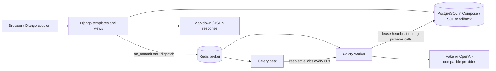

# TaleTomo — current architecture and PRD conformance

> **Scope:** `D:\projects\novel-maker`, branch `main`, commit `ea775c7` plus architecture-improvement changes in the working tree (lease heartbeat, stale-job reaper, canon extraction and review, relevance-ranked context assembly), reviewed September 26, 2026 (WIB). This is a source/test/configuration review, **not** a deployed-system certification. The [PRD](PRD.md) remains the target design. The [README](../README.md) is the setup guide. Code and observed checks outrank older documents.

## 1. What is actually built

TaleTomo is a Django 5.1 modular monolith with server-rendered templates and two small Vue islands for job polling and the editor drawer (`taletomo/templates/`, `taletomo/static/js/app.js`). It uses Django sessions and login views (`config/urls.py`), PostgreSQL via `DATABASE_URL` or SQLite for local development (`config/settings.py:69-92`), Celery tasks with Redis broker (`config/celery.py`, `taletomo/generation/tasks.py`), and a per-user provider gateway. The development Compose stack has **db, redis, web, worker, beat** services; Beat schedules the stale-job reaper every 60 seconds. The pgvector-enabled PostgreSQL **image** is selected, but vector schema, index, and retrieval queries remain target design.

This diagram represents configured code paths, not proof of a running or resilient deployment. No separate object store is configured. The `storage/exports` directory is created in settings but current export views return HTTP responses directly (`taletomo/web/views.py`).

## 2. Runtime topology and configuration

| Component | Current working-tree configuration | Qualification |
|---|---|---|
| Web | Compose `web`: `migrate && runserver 0.0.0.0:8088`, host port **8088** (`docker-compose.yml`) | Development server, `DEBUG=True`, bind-mounted source; **not production-ready**. |
| Worker | Compose `worker`: `celery -A config worker -l INFO` (`docker-compose.yml`) | Task dispatch via `transaction.on_commit`; cooperative cancellation check exists; a lease-conflict in the task runner no longer clobbers a healthy job's status. |
| Beat | Compose `beat`: `celery -A config beat -l INFO` (`docker-compose.yml`) | Runs the stale-job reaper every 60 s (`config/celery.py` beat schedule). |
| Database | PostgreSQL 16 pgvector image, host port **5433**, named volume; SQLite without `DATABASE_URL` | Vector search not yet implemented. Migrations run at web startup. |
| Redis | Redis 7, host port **6380**, named volume (`docker-compose.yml`) | Broker and result backend; application job and lease rows live in DB. |
| Job recovery | `LeaseHeartbeat` (`taletomo/generation/heartbeat.py`) + `reap_stale_jobs` (`taletomo/generation/reaper.py`, management command + beat task) | Heartbeat renews the lease during long provider calls; reaper requeues never-submitted jobs, fails unknown-outcome jobs with reservations held, and re-dispatches queued jobs whose broker dispatch was lost. |
| API providers | Fake adapter and OpenAI-compatible chat-completions adapter (`taletomo/providers/adapters.py`) | `NATIVE` enum routes to the compatible adapter; no distinct native SDK implementation. Fake-provider routing uses explicit task markers (`TASK: DRAFT_CHAPTER`, `TASK: CRITIQUE_CONTINUITY`, `TASK: EXTRACT_CANON`) that outrank legacy keyword matching. |
| SSRF protection | Custom endpoint IP/scheme validator (`taletomo/providers/security.py`) | Blocks localhost, cloud metadata (`169.254.169.254`), private subnets, CGNAT, and IPv4-mapped IPv6. |
| Encryption | Fernet-based API key storage (`taletomo/core/crypto.py`) | Development fallback key exists in settings; configure private secret for non-disposable environments. |

`CELERY_ALWAYS_EAGER` defaults to **False** (`config/settings.py`). When explicitly true, `.delay()` runs synchronously; that mode is for local/tests, not proof of async behavior. Docker configuration parsing succeeds; a fresh full-stack startup and live provider-backed novel generation were **not** verified in this review. Local `.env` loading is not implemented by this repository.

## 3. Request and data boundaries

- Django's `@login_required` protects all application views. Project lookups check `owner=request.user`; chapter lookups verify project ownership; job, finding, draft comparison and provider-test lookups are strictly user- and project-scoped (`taletomo/web/views.py`). Cross-tenant IDOR negative tests verify 404/redirect boundaries (`tests/test_implementation_review_fixes.py`).
- First-user setup guides the initial author on an empty database; setup automatically closes once an account exists (`tests/test_first_run_setup.py`).
- Project creation is **one form**, not the PRD's resumable multi-step wizard. `PlanningService.create_project_with_scaffold` creates a Bible, Spine, **one** Volume/Arc and at most five initial chapters with templated contracts (`taletomo/planning/services.py:21-122`). `ensure_rolling_horizon` maintains the initial horizon window (`:124-169`).
- Relational models cover Project, SeriesBible, SeriesSpine, Volume, Arc, Chapter/Plan/Scene, Character, Location, Faction, WorldRule, TimelineEvent, PlotThread, CanonFact, StoryEvent/Snapshot, ProposedCanonItem, StyleTerm, ContextManifest, DraftArtifact, GenerationJob/Attempt, BudgetReservation and ContinuityFinding.
- Provider security and scoping: custom endpoints are validated against SSRF vulnerabilities before save or execution. Provider adapters and template context processors are scoped to `request.user` (`tests/test_security_boundaries.py`).
- Locked chapters: committed chapters cannot be re-generated or modified without an explicit administrative unlock.
- Draft diffing: draft comparisons strictly reject attempts to compare drafts across different chapters.

## 4. Drafting, context, and canon: actual sequence

1. Author posts to `chapter_generate`; the view verifies the chapter is not locked, calculates a chapter/version idempotency key (`draft-{chapter_id}-v{next_v}`), creates a `GenerationJob`, and schedules Celery dispatch on transaction commit (`taletomo/web/views.py`). Active running jobs are reused rather than duplicated, and a concurrent-submission race on the unique idempotency key is handled instead of surfacing a 500.
2. `GenerationPipeline` acquires a database row-lock-backed lease (90 seconds) and starts a `LeaseHeartbeat` daemon thread that renews the lease every lease-duration/3 until the pipeline finishes — a provider call may legitimately outlast the initial window, and without renewal a second worker could acquire the expired lease and double-generate (double billing). The pipeline then resolves a user-scoped provider, reads the model context limit (supporting profiles up to 250,000 tokens), sizes the output window from the chapter's word target (`BudgetCalculator.estimate_output_tokens`, ~1.5 tokens/word, clamped to the profile's `max_output`), assembles a context manifest, records a token/cost budget reservation **derived from the assembled context size and the model's pricing profile** (25% headroom; zero when no pricing is configured), checks for cooperative cancellation, calls the provider with that output window, creates a draft, runs continuity checks, extracts proposed canon, and marks the job ready (`taletomo/generation/pipeline.py`). The OpenAI-compatible adapter retries pre-submission failures (connection refused/connect timeout/429) exactly once with backoff; timeouts after submission raise `TimeoutError` and stay billing-unknown (`taletomo/providers/adapters.py`).
   - If the provider times out, the attempt records `unknown_provider_outcome`, the job status is set to `FAILED` with `stage="Unknown provider outcome: timeout after submission"`, and `error_details={"unknown_outcome": True}`. Crucially, the budget reservation is **retained (held)** rather than blindly released to prevent financial drift.
   - If the worker dies mid-run, the beat-scheduled reaper applies the billing-safe policy (`taletomo/generation/reaper.py`): no attempt recorded → requeue automatically; attempt in flight → `FAILED` with `unknown_outcome=True` and reservation held; attempt completed → `FAILED` for a manual, user-consented retry. QUEUED jobs untouched past the grace window (`TALETOMO_REAPER_QUEUED_GRACE_SECONDS`, default 900 s) are treated as lost broker dispatches and re-queued; the lease makes duplicate dispatch safe.
3. `ContextAssembler` enforces category quotas with token estimation and **relevance-ranked** entity selection: candidates (characters, locations, factions, rules, threads, facts) are scored against the chapter contract, title, and recent narrative, then included best-first within each category budget. Ranking only reorders and budget-gates — it never excludes candidates while budget remains, so the anti-leakage invariant (facts with provenance chapter ≥ current chapter excluded unless plan-only) holds regardless of scores (`taletomo/context/retrieval.py`). Prompts additionally carry per-scene word budgets, the **previous chapter's closing prose** (last 250 words), and the **style dictionary block**: the project's genre/subgenre/tone/POV/tense/pacing values are resolved (comma/slash-token aware, case-insensitive) against builtin and author-created `StyleTerm` records, and their definitions and examples are injected as non-mandatory constraints. Source IDs, scores, SHA-256 hash, and estimated tokens persist into a `ContextManifest`. Full-text/vector ranking remains target design.
4. `ContinuityChecker` runs generalized deterministic checks: injury detection extracts (side, limb) pairs from each character's wound record (gated on impairment wording) and flags prose where action verbs operate the impaired limb — a shattered knee blocks "his right knee screamed" while a fear of crowds blocks nothing. Deceased-character mentions stay review warnings, and findings are deduplicated per chapter against open claims (`taletomo/consistency/checker.py`). Manual author saves run the same deterministic checks (`chapter_edit`), and optional model critique is marked via the `TASK: CRITIQUE_CONTINUITY` prompt marker.
5. `CanonExtractionService` extracts structured proposals from the drafted prose: story events, subject–predicate–value claims, plot-thread updates, and **character-state updates** (wounds_status / is_alive / goals for known cast members, resolved by exact, alias, or first-token name match), persisted as `ProposedCanonItem` rows (`taletomo/canon/extraction.py`). Claims canon already confirms are skipped, invalid scopes are coerced to world truth, extraction is non-fatal (a failure never loses the completed draft), and re-extraction of the same draft replaces only pending proposals, preserving author-reviewed ones. Proposals are inert until reviewed.
6. Two-phase canon lifecycle:
   - Phase 1: Author reviews and approves draft prose (`chapter_approve_draft`), advancing chapter status to `APPROVED` and draft to `ACCEPTED`.
   - Human-in-the-loop review: the author approves or rejects each proposal on the per-chapter canon review page (`chapter_canon_review`, `proposed_canon_update`); a manual re-extraction button covers manually edited drafts (`chapter_extract_canon`).
   - Phase 2: Author commits canonical story changes (`chapter_commit_canon` calling `CanonService.commit_chapter_canon`, `taletomo/canon/services.py`). Approved proposals flow into the atomic commit as facts (with `Chapter N` provenance), story events, plot-thread updates (open/advance/reinforce/close/abandon with notes and payoff chapters), and character-state updates (rewriting the cast records continuity checking depends on), all inside the same transaction. Committed proposals are marked `CONSUMED`.
   - Domain guards: `commit_chapter_canon` validates `actor.pk == current_project.owner_id` (raising `PermissionError`), verifies branch head matches `expected_head`, checks that the chapter belongs to the project and is approved with an accepted draft and an approved/locked plan, and requires a non-empty `override_rationale` (raising `ValueError`) if open blocker findings exist. On commit, it appends story events, confirms canon facts, applies thread and character updates, advances the head, snapshots state, and locks the chapter.
7. Job cancellation and retry:
   - `job_cancel` marks non-terminal jobs cancelled and releases pending budget reservations.
   - `job_retry` checks `error_details["unknown_outcome"]` and blocks automatic retry if billing status remains uncertain, requiring manual reconciliation.

## 5. Exports and storage

`ExportService` writes Markdown or JSON from the current project (`taletomo/exporting/services.py`).
- **Markdown export:** formats the manuscript with project metadata, premises, and the latest or active versioned draft prose.
- **JSON backup & restore:** exports a structured, versioned snapshot covering Project settings, SeriesBible, SeriesSpine, Volumes, Arcs, Chapters, ChapterPlans, ScenePlans, DraftArtifacts (retaining version numbers, active pointers, and parent draft lineage), Characters (traits, wounds, beliefs, alive status), Locations, WorldRules, Factions, TimelineEvents, PlotThreads, StoryEvents, and confirmed CanonFacts.
- **Integrity & Zero-Secret Security:** A SHA-256 checksum manifest is calculated over the exported payload (excluding the manifest itself) and validated prior to database writes during restore (`test_backup_tampering_rejection_and_full_restore`). Upload files are capped at 25 MB (`taletomo/web/views.py:737`). API keys and provider secrets are strictly omitted from backups. Restore reconstructs an independent new project.
- **Parity boundaries:** Ephemeral generation jobs, attempts, unconfirmed findings, and temporary context manifests are intentionally omitted from backups.

## 6. PRD comparison (as of this working tree)

| PRD concern | Status | Code/test evidence and gap |
|---|---|---|
| Multi-page, authenticated navigation | **Partial** | Owner-scoped pages, first-run setup, and login added; full multi-step creation wizard and search routes remain target design (`web/urls.py`). |
| 1–4,000 chapter target | **Partial** | Model validators plus a 4,000-row pagination test; full-length project continuous drafting/recovery load test not yet run. |
| Hierarchical planning | **Partial** | Models and initial scaffold; AI-generated series/volume/arc plans and automatic frontier advance remain target design. |
| BYOK and 250k context | **Partial** | Encrypted per-user configs, SSRF-guarded custom endpoints, and model-profile context limit plumbing; live 250k-token provider calls unverified. |
| Durable, asynchronous jobs | **Mostly done** | Worker/queue, DB row lease, lease heartbeat during provider calls, stale-job reaper with billing-safe policy, cooperative cancel check, held reservation on unknown outcomes, and blind-retry prevention exist; multi-worker soak tests and live broker-failure drills remain. |
| Long-term memory/hybrid retrieval | **Partial** | Relevance-ranked entity selection with token budgets and recency tiebreaks; no full-text/vector index, embedding model, or measured coverage gates. |
| Character/plot/world/genre consistency | **Partial** | Relational entities, generalized wound-record injury detection (side+limb+impairment gated), deceased-character warnings, deduplicated findings on generated and manually saved drafts; golden evaluation thresholds not yet wired. |
| Human-controlled canon | **Mostly done** | Owner authorization, draft approval vs canon commit separation, structured extraction of proposed facts/events/thread updates/character-state updates with per-item author review, non-empty override rationale, and chapter locking enforced; extraction quality on live providers unverified. |
| Immutable drafts and revisions | **Partial** | Versioned drafts with parent lineage and cross-chapter diff protection; scene revision and branch topology remain target design. |
| Portable backup and restore | **Partial** | Comprehensive structural schema restored with SHA-256 integrity verification; ephemeral jobs/findings omitted. Proposed-canon items are not yet included in backups. |
| Production security/operations | **Not ready** | `check --deploy` produces six development-setting warnings; production deployment configuration (HTTPS, HSTS, secrets) required before public release. |

**Interpretation:** the 108 passing tests cover core happy paths, security boundaries, job-recovery policy, the canon extraction/review/commit loop, prompt-quality sizing, the style dictionary, and regression scenarios, not the full PRD release gates or live provider validation.

## 7. Verification and next gates

On September 26, 2026 (WIB), using the project's Python 3.12 virtualenv:

- `pytest -q`: **109 passed, 1 skipped in ~20 s** (PostgreSQL lease serialization test skipped cleanly under SQLite fallback). Suites: lease heartbeat and lease-theft prevention, stale-job reaper policy (never-submitted / unknown-outcome / post-provider / lost dispatch), canon extraction, review scoping, and the approve→commit loop (including character-state updates and confirmed-fact dedupe), relevance-ranked retrieval under budget pressure, output sizing and reservation derivation, previous-ending/scene-budget prompt quality, generalized injury detection, manual-save checks with dedupe, OpenAI-adapter retry semantics, and the style dictionary (seeded terms, resolution, owner-scoped additions, prompt injection, protagonist-type axis).
- `manage.py check`: **0 issues identified**; `makemigrations --check --dry-run`: **no changes detected**.
- `docker compose config --quiet`: parses **five services** (db, redis, web, worker, beat). Full production stack deployment was **not** run in this review.
- `manage.py check --deploy`: **six warnings** with current development defaults (HSTS, HTTPS redirect, secret key, session/CSRF secure cookies, DEBUG).

Next development gates, in order:
1. Build hybrid (full-text + vector) retrieval on the pgvector image with golden evaluation fixtures; wire embedding generation into the extraction loop.
2. Include `ProposedCanonItem` records in JSON backup/restore for full parity.
3. Run synthetic 4,000-chapter load, retrieval latency, and recovery simulation (including multi-worker lease-steal soak tests and broker-failure drills).
4. Production hardening (HTTPS/HSTS enforcement, production secret handling, and isolated migration runner).

## 8. Document maintenance

Keep this file descriptive of the **working tree actually reviewed**. Keep aspirational requirements in `PRD.md` and runnable setup in `README.md`. Re-run tests/config checks and update the review date/evidence whenever architecture or requirements change; never promote this working-tree assessment into a deployed claim without separate production verification.
