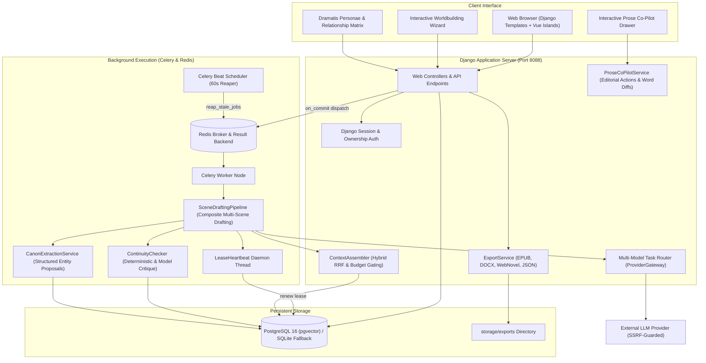
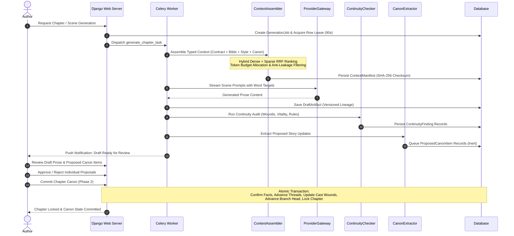
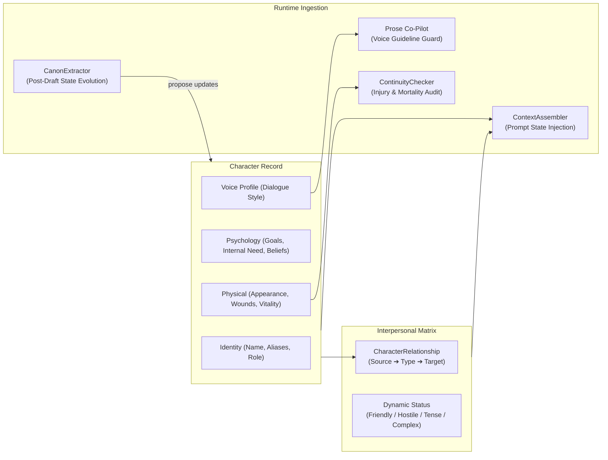
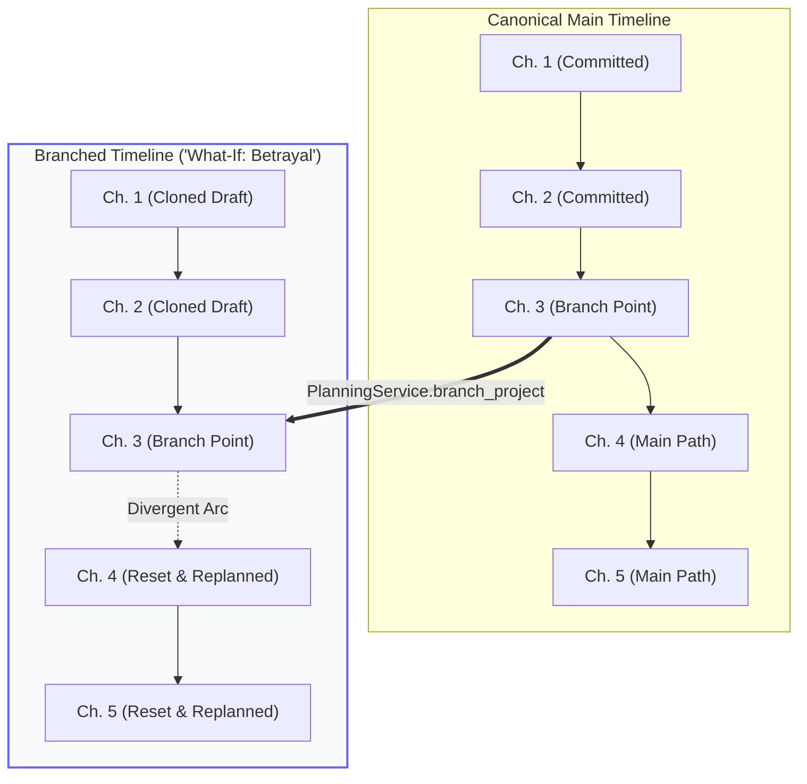

# TaleTomo — System Architecture & Conformance Reference

> **Scope:** `D:\projects\novel-maker`, branch `main`, verified as of October 1, 2026 (WIB). Incorporates the 10 Core Expansion Engines, Interactive Prose Co-Pilot, Character Design & Tracking Subsystem, and Clean Architecture Refactoring. This document serves as the authoritative technical reference for TaleTomo's components, data flows, and invariants. The [PRD](PRD.md) specifies target design goals. The [README](../README.md) provides quickstart instructions.

---

## 1. High-Level System Architecture

TaleTomo is a Django 5.1 modular monolith engineered for long-form fiction planning, drafting, and continuity governance. The frontend combines server-rendered Django templates with reactive Vue islands for real-time draft generation polling, interactive drawer editing, and in-editor Prose Co-Pilot assistance.

The backend leverages Celery workers with a Redis broker, managed row leases with active heartbeats to prevent double-generation, and an asynchronous stale-job reaper daemon.


```mermaid
flowchart TD
    subgraph Client["Client Interface"]
        UI["Web Browser (Django Templates + Vue Islands)"]
        CoPilotUI["Interactive Prose Co-Pilot Drawer"]
        WizardUI["Interactive Worldbuilding Wizard"]
        CharUI["Dramatis Personae & Relationship Matrix"]
    end

    subgraph WebServer["Django Application Server (Port 8088)"]
        Views["Web Controllers & API Endpoints"]
        Auth["Django Session & Ownership Auth"]
        Router["Multi-Model Task Router (ProviderGateway)"]
        Assembler["ContextAssembler (Hybrid RRF & Budget Gating)"]
        CopilotSvc["ProseCoPilotService (Editorial Actions & Word Diffs)"]
        ExportSvc["ExportService (EPUB, DOCX, WebNovel, JSON)"]
    end

    subgraph AsyncWorker["Background Execution (Celery & Redis)"]
        Broker[("Redis Broker & Result Backend")]
        Worker["Celery Worker Node"]
        Beat["Celery Beat Scheduler (60s Reaper)"]
        Pipeline["SceneDraftingPipeline (Composite Multi-Scene Drafting)"]
        Heartbeat["LeaseHeartbeat Daemon Thread"]
        Continuity["ContinuityChecker (Deterministic & Model Critique)"]
        Extractor["CanonExtractionService (Structured Entity Proposals)"]
    end

    subgraph Storage["Persistent Storage"]
        DB[("PostgreSQL 16 (pgvector) / SQLite Fallback")]
        Exports["storage/exports Directory"]
    end

    UI --> Views
    CoPilotUI --> CopilotSvc
    WizardUI --> Views
    CharUI --> Views
    Views --> Auth
    Views --> DB
    Views -->|on_commit dispatch| Broker
    Broker --> Worker
    Beat -->|reap_stale_jobs| Broker
    Worker --> Pipeline
    Pipeline --> Heartbeat
    Heartbeat -->|renew lease| DB
    Pipeline --> Assembler
    Assembler --> DB
    Pipeline --> Router
    Router --> ExtLLM["External LLM Provider (SSRF-Guarded)"]
    Pipeline --> Continuity
    Continuity --> DB
    Pipeline --> Extractor
    Extractor --> DB
    Views --> ExportSvc
    ExportSvc --> Exports
```

---

## 2. Drafting, Context & Two-Phase Canon Lifecycle

TaleTomo enforces a strict two-phase separation of concerns: generating prose draft artifacts does not silently mutate story canon. Canon mutations require explicit human-in-the-loop review and atomic commits.


```mermaid
sequenceDiagram
    autonumber
    actor Author
    participant Web as Django Web Server
    participant Celery as Celery Worker
    participant Assembler as ContextAssembler
    participant Provider as ProviderGateway
    participant Checker as ContinuityChecker
    participant Extractor as CanonExtractor
    participant DB as Database

    Author->>Web: Request Chapter / Scene Generation
    Web->>DB: Create GenerationJob & Acquire Row Lease (90s)
    Web->>Celery: Dispatch generate_chapter_task
    Celery->>Assembler: Assemble Typed Context (Contract + Bible + Style + Canon)
    Note over Assembler: Hybrid Dense + Sparse RRF Ranking<br/>Token Budget Allocation & Anti-Leakage Filtering
    Assembler->>DB: Persist ContextManifest (SHA-256 Checksum)
    Celery->>Provider: Stream Scene Prompts with Word Targets
    Provider-->>Celery: Generated Prose Content
    Celery->>DB: Save DraftArtifact (Versioned Lineage)
    Celery->>Checker: Run Continuity Audit (Wounds, Vitality, Rules)
    Checker->>DB: Persist ContinuityFinding Records
    Celery->>Extractor: Extract Proposed Story Updates
    Extractor->>DB: Queue ProposedCanonItem Records (Inert)
    Celery-->>Author: Push Notification: Draft Ready for Review

    Author->>Web: Review Draft Prose & Proposed Canon Items
    Author->>Web: Approve / Reject Individual Proposals
    Author->>Web: Commit Chapter Canon (Phase 2)
    Note over Web,DB: Atomic Transaction:<br/>Confirm Facts, Advance Threads, Update Cast Wounds,<br/>Advance Branch Head, Lock Chapter
    Web-->>Author: Chapter Locked & Canon State Committed
```

---

## 3. Core Subsystems & Technical Architecture

### 3.1 Character Design, Voice Profiling & Relationship Matrix
The cast subsystem ([`taletomo/canon/models.py`](file:///D:/projects/novel-maker/taletomo/canon/models.py)) models characters with narrative, psychological, and physical depth:
* **Visual & Presence Design:** [`appearance`](file:///D:/projects/novel-maker/taletomo/canon/models.py#L41-L43) defines distinctive clothing, hair, scars, and physical presence.
* **Distinct Dialogue & Speech Voice:** [`dialogue_style`](file:///D:/projects/novel-maker/taletomo/canon/models.py#L44-L46) defines cadence, dialect, vocabulary level, and spoken idioms. Automatically injected into [`ContextAssembler`](file:///D:/projects/novel-maker/taletomo/context/retrieval.py) and [`ProseCoPilotService`](file:///D:/projects/novel-maker/taletomo/generation/copilot.py) under `CHARACTER VOICE GUIDELINES`.
* **Vitality & Physical Wounds:** Tracks alive vs. deceased status ([`is_alive`](file:///D:/projects/novel-maker/taletomo/canon/models.py#L47)) and physical impairments ([`wounds_status`](file:///D:/projects/novel-maker/taletomo/canon/models.py#L50)). The continuity engine flags drafted actions violating active impairments.
* **Interpersonal Relationship Matrix ([`CharacterRelationship`](file:///D:/projects/novel-maker/taletomo/canon/models.py#L84)):** Pairwise interpersonal connections with dynamic social tension states (`friendly`, `hostile`, `tense`, `neutral`, `complex`). When two characters share a scene, their relationship history is injected into the context window.
* **Cast Presence & POV Tracking:** Aggregates real-time presence across chapter contracts, scene breakdowns (`ScenePlan.characters`), and perspective assignments (`Chapter.pov_character_name`).


```mermaid
flowchart LR
    subgraph CharacterModel["Character Record"]
        Identity["Identity (Name, Aliases, Role)"]
        Psych["Psychology (Goals, Internal Need, Beliefs)"]
        Physical["Physical (Appearance, Wounds, Vitality)"]
        Voice["Voice Profile (Dialogue Style)"]
    end

    subgraph Dynamics["Interpersonal Matrix"]
        Rel["CharacterRelationship<br/>(Source ➔ Type ➔ Target)"]
        Status["Dynamic Status<br/>(Friendly / Hostile / Tense / Complex)"]
    end

    subgraph Runtime["Runtime Ingestion"]
        CA["ContextAssembler<br/>(Prompt State Injection)"]
        CoPilot["Prose Co-Pilot<br/>(Voice Guideline Guard)"]
        CC["ContinuityChecker<br/>(Injury & Mortality Audit)"]
        CE["CanonExtractor<br/>(Post-Draft State Evolution)"]
    end

    CharacterModel --> Rel
    Dynamics --> CA
    CharacterModel --> CA
    Voice --> CoPilot
    Physical --> CC
    CE -->|propose updates| CharacterModel
```

### 3.2 Hybrid Retrieval & Reciprocal Rank Fusion (Dense + Sparse)
[`ContextAssembler`](file:///D:/projects/novel-maker/taletomo/context/retrieval.py) solves the context window packing problem for long novels:
* **Sparse Lexical Scoring:** Matches chapter contract objectives, beats, and character names against candidate canon entities.
* **Dense Semantic Scoring:** Vector embeddings with cosine similarity computed via [`compute_cosine_similarity`](file:///D:/projects/novel-maker/taletomo/canon/models.py#L14).
* **Reciprocal Rank Fusion (RRF):** Combines sparse and dense ranks using $RRF(c) = \frac{1}{60 + r_{\text{sparse}}} + \frac{1}{60 + r_{\text{dense}}}$.
* **Recency Tiebreaking:** Confirmed facts with equal relevance are broken by chronological chapter provenance.
* **Deterministic Anti-Leakage:** Facts established in chapter $N \ge \text{current}$ are strictly excluded unless explicitly tagged `TruthScope.PLAN_ONLY` or `TruthScope.AUTHOR_NOTE`.
* **Category Budgeting:** Managed by [`ContextBudgetTracker`](file:///D:/projects/novel-maker/taletomo/context/retrieval.py#L64), strictly enforcing mandatory constraints without truncation.

### 3.3 Multi-Scene Drafting Pipeline (`SceneDraftingPipeline`)
Chapters are drafted either as monolithic units or scene-wise via [`SceneDraftingPipeline`](file:///D:/projects/novel-maker/taletomo/generation/pipeline.py):
* Individual scenes receive allocated token budgets derived from `ScenePlan.estimated_words`.
* Sequential context propagation carries the tail of Scene $K-1$ into Scene $K$.
* Composite drafts are assembled, and the full multi-scene text undergoes unified continuity and canon extraction audits.

### 3.4 Interactive Prose Co-Pilot & Editorial Engine (`ProseCoPilotService`)
In-editor writing assistant ([`taletomo/generation/copilot.py`](file:///D:/projects/novel-maker/taletomo/generation/copilot.py)) providing surgical inline adjustments:
* **Editorial Actions:** `show_not_tell`, `sensory_immersion`, `punch_up_dialogue`, `intensify_tension`, `expand`, and `fix_continuity`.
* **Visual Diff Engine:** Generates instant HTML word-level additions (`<ins>`) and deletions (`<del>`).
* **Voice Grounding:** Inspects the selected passage and active POV character, injecting character voice guidelines to preserve speech mannerisms.

### 3.5 Story Timeline Branching ("What-If" Parallel Realities)
[`PlanningService.branch_project`](file:///D:/projects/novel-maker/taletomo/planning/services.py#L697) creates divergent narrative branches:
* Deep clones the SeriesBible, Spine, Volumes, Arcs, and historical Chapter drafts up to the branch point chapter.
* Clones all canon entities (characters, locations, rules, factions, items) and historical character relationships into the branched project.
* Unplanned future chapters are reset to `UNPLANNED`, and a rolling horizon replan adapts future contracts to the branched storyline.


```mermaid
flowchart TD
    subgraph Canonical["Canonical Main Timeline"]
        M1["Ch. 1 (Committed)"] --> M2["Ch. 2 (Committed)"]
        M2 --> M3["Ch. 3 (Branch Point)"]
        M3 --> M4["Ch. 4 (Main Path)"]
        M4 --> M5["Ch. 5 (Main Path)"]
    end

    subgraph WhatIf["Branched Timeline ('What-If: Betrayal')"]
        B1["Ch. 1 (Cloned Draft)"] --> B2["Ch. 2 (Cloned Draft)"]
        B2 --> B3["Ch. 3 (Branch Point)"]
        B3 -.->|Divergent Arc| Alt4["Ch. 4 (Reset & Replanned)"]
        Alt4 --> Alt5["Ch. 5 (Reset & Replanned)"]
    end

    M3 ==>|PlanningService.branch_project| B3
    style WhatIf fill:#f8fafc,stroke:#6366f1,stroke-width:2px
```

### 3.6 Dynamic Rolling Horizon Replanning (`replan_frontier`)
Adapts future uncommitted contracts to recently committed story canon ([`PlanningService.replan_frontier`](file:///D:/projects/novel-maker/taletomo/planning/services.py#L204)):
* Inspects active character wounds, open plot threads, and recent canon facts.
* Dynamically rewires required beats and prohibited outcomes across the active planning horizon (default 5 chapters).

### 3.7 Interactive Worldbuilding Wizard (`WorldbuildingWizard`)
Multi-step generative setup interview ([`taletomo/planning/wizard.py`](file:///D:/projects/novel-maker/taletomo/planning/wizard.py)):
* Steps: Premise & Genre ➔ World Setting & Magic/Tech ➔ Factions & Power Balance ➔ AI Cast Proposal ➔ Spine & Volume Milestones.
* Atomically commits scaffolded projects with complete initial canon entities.

### 3.8 Rich Multi-Format Publishing & Backup Suite (`ExportService`)
[`ExportService`](file:///D:/projects/novel-maker/taletomo/exporting/services.py) supports export and restore:
* **EPUB:** Complete eBook archive with `mimetype`, `META-INF/container.xml`, `content.opf`, `toc.ncx`, and styled typography.
* **DOCX:** Formatted Word document with chapter headings and standard manuscript indentations.
* **Web Novel HTML:** Self-contained reader with dark/light mode toggle and chapter navigation.
* **Markdown:** Full plain text manuscript.
* **JSON Backup & Restore:** Cryptographically signed snapshot with SHA-256 manifest verification and zero-secret leakage.

---

## 4. Verification Evidence & Quality Gates

Automated test execution conducted on October 1, 2026 using Python 3.12:

```bash
pytest -q
# Output: 174 passed, 1 skipped in 49.56s
```

* **Test Suite Modules:**
  - `test_character_design_and_tracking.py`: Cast profiles, voice injection, relationship matrix, web view CRUD, and scene tracking.
  - `test_refactoring_deduplication.py`: Unified character resolution, cosine similarity edge cases, and `ContextBudgetTracker` invariants.
  - `test_hybrid_retrieval.py` & `test_retrieval_ranking.py`: Sparse + dense RRF, anti-leakage invariant, and adapter query embeddings.
  - `test_prose_copilot.py`: Editorial actions, word diff calculation, and character voice constraints.
  - `test_story_branching.py`: Timeline isolation, state cloning, and relationship preservation.
  - `test_export_restore.py` & `test_rich_export.py`: EPUB, DOCX, WebNovel, and JSON backup/restore parity.
  - `test_continuity.py`: Injury detection, vitality tracking, and knowledge asymmetry.
  - `test_canon_extraction.py`: Proposal generation, human review, and atomic two-phase commit.
  - `test_security_boundaries.py` & `test_ssrf.py`: Tenant isolation and SSRF defense.
* **System Checks:** `manage.py check` reports **0 issues**; `makemigrations --check --dry-run` reports **no pending migrations**.
